# WalkingMate

> 나의 일상 속 워킹 메이트  
> 한이음 드림업(ICT 멘토링) 프로젝트

WalkingMate는 걷기 기록, 메이트 모집, 피드, 채팅을 한 앱에서 제공하는 Android 서비스입니다.

## 주요 기능
- 산책 기록(거리/시간/경로)
- 메이트 모집 글 작성 및 신청/수락 관리
- 피드 업로드 및 조회
- 1:1 및 그룹 채팅
- 지도 기반 경로 표시
- 음악 추천/재생 기능

## 화면 및 기능 설명
### 1. 로그인 화면
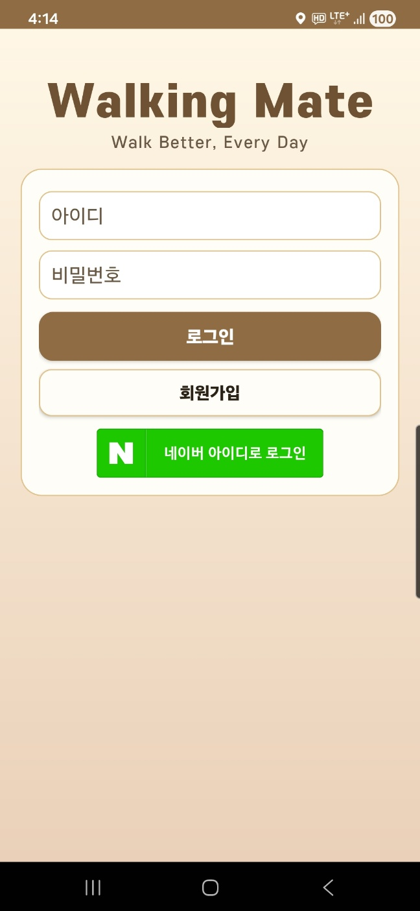

- 기능: 일반 로그인, 회원가입 진입, 네이버 간편 로그인
- 설명: 아이디/비밀번호 로그인과 소셜 로그인(네이버)을 한 화면에서 제공하는 시작 화면

### 2. 회원가입 화면
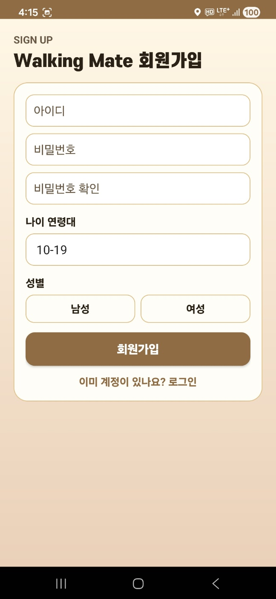

- 기능: 계정 생성(아이디, 비밀번호, 비밀번호 확인, 연령대, 성별)
- 설명: 기본 사용자 정보를 입력해 WalkingMate 계정을 생성하는 가입 화면

### 3. 워킹 홈 대시보드
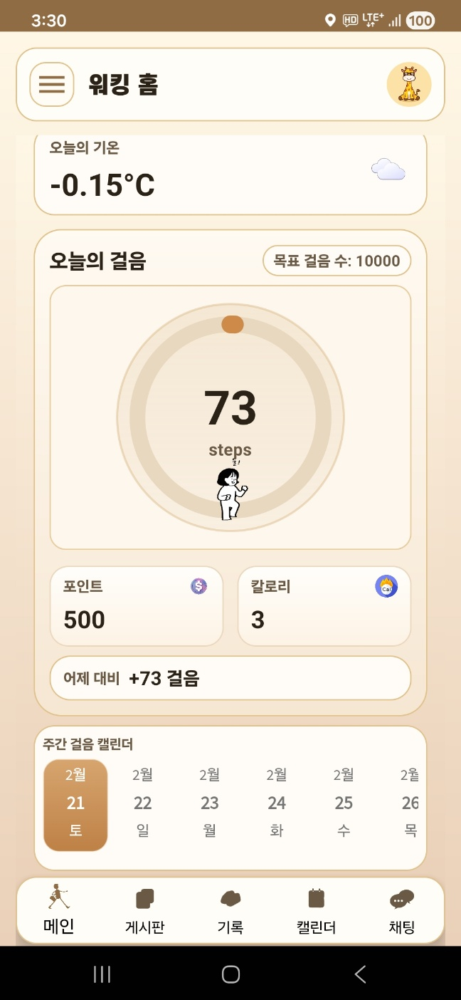

- 기능: 오늘의 걸음 수, 목표 걸음, 포인트/칼로리, 주간 캘린더 확인
- 설명: 일일 걷기 데이터를 한 번에 확인하는 메인 홈 화면

### 4. 게시판 목록(메이트 모집)
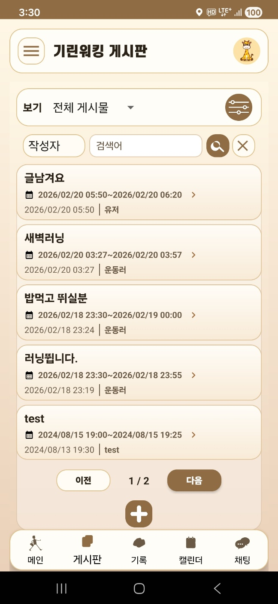

- 기능: 모집글 목록 조회, 검색/필터, 페이지 이동, 글 작성
- 설명: 함께 걸을 메이트를 찾기 위한 모집글 탐색 화면

### 5. 기록 캘린더 화면
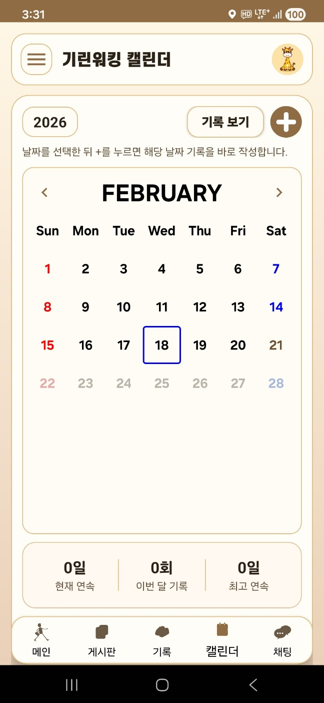

- 기능: 월별 기록 조회, 날짜 선택, 기록 보기/작성
- 설명: 날짜 기준으로 산책 기록을 관리하는 캘린더 화면

### 6. 채팅 탭
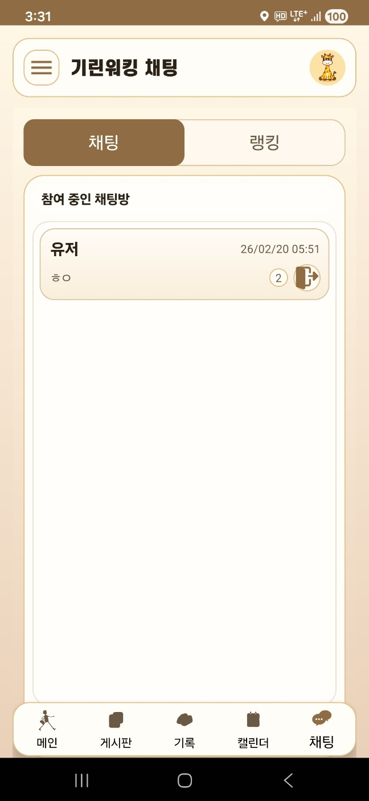

- 기능: 참여 중 채팅방 목록 확인 및 입장
- 설명: 메이트/산책 관련 채팅방을 모아 보는 화면

### 7. 랭킹 탭
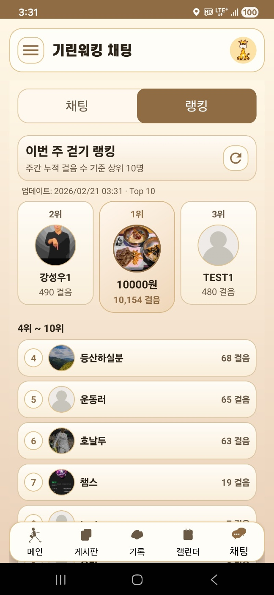

- 기능: 주간 걸음 수 랭킹, TOP 사용자 확인
- 설명: 사용자 활동량을 순위로 확인하는 경쟁형 화면

### 8. 산책 트래킹 지도
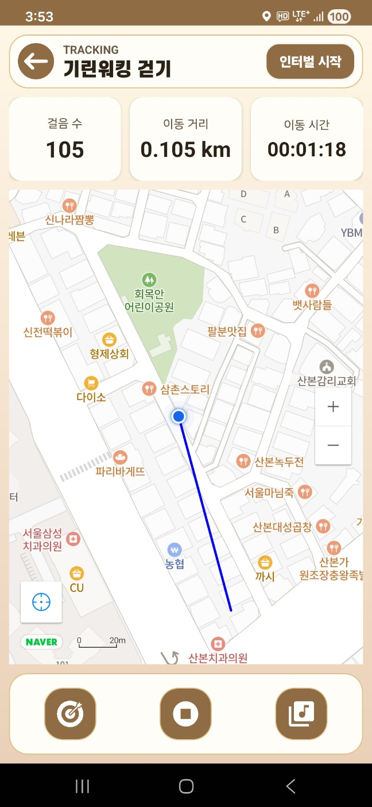

- 기능: 실시간 걸음/거리/시간 측정, 지도 경로 표시
- 설명: 실제 이동 경로를 기록하는 실시간 트래킹 화면

### 9. 산책 종료 확인 다이얼로그
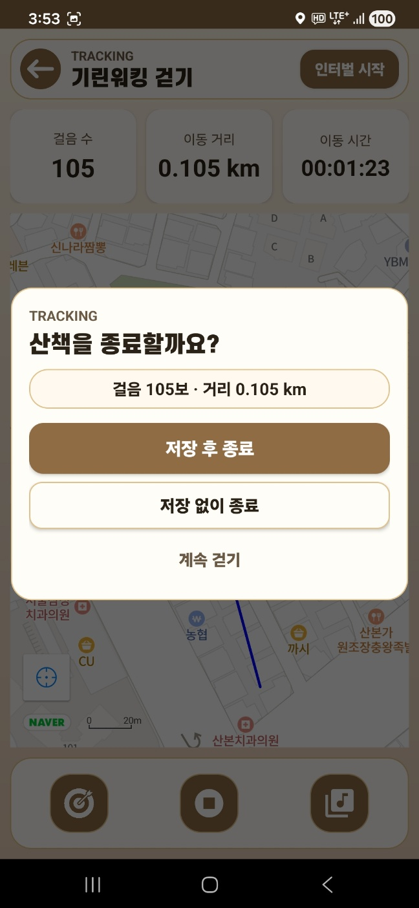

- 기능: 저장 후 종료, 저장 없이 종료, 계속 걷기 선택
- 설명: 트래킹 종료 시 기록 처리 방식을 선택하는 확인 UI

### 10. 메이트 게시글 상세
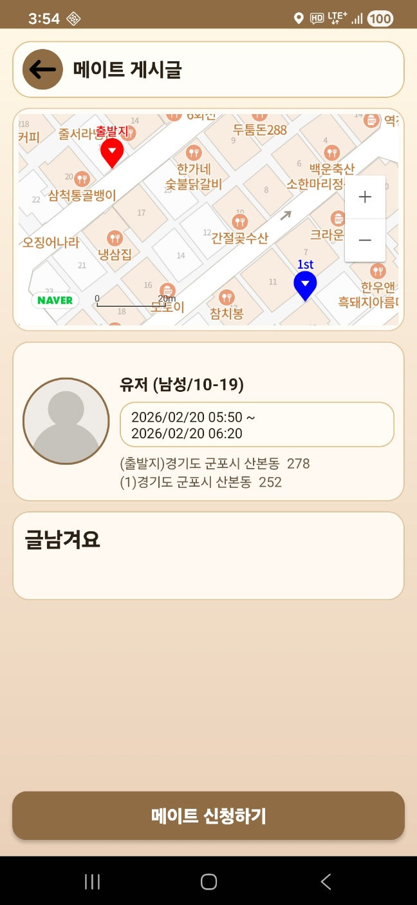

- 기능: 경로/일정/장소/작성자 정보 확인, 메이트 신청
- 설명: 모집글의 상세 정보를 보고 신청하는 화면

### 11. 피드 목록 화면
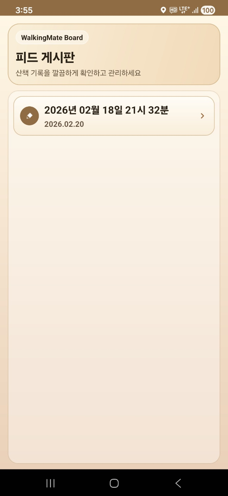

- 기능: 산책 기록 기반 피드 목록 조회
- 설명: 업로드된 피드 기록을 리스트 형태로 확인하는 화면

### 12. 신청 목록 관리


- 기능: 대기/수락 신청자 확인, 수락/거절/채팅, 게시물 삭제
- 설명: 작성자가 신청자를 관리하는 메이트 신청 관리 화면

### 13. 1:1 채팅 화면


- 기능: 메시지 송수신, 채팅방 상호작용
- 설명: 메이트 사용자와 실시간으로 대화하는 채팅 화면

### 14. 채팅 참가자 목록


- 기능: 참여자 확인, 방장 권한 정보 표시
- 설명: 채팅방 참여 인원을 관리/확인하는 사이드 패널

### 15. 사용자 프로필
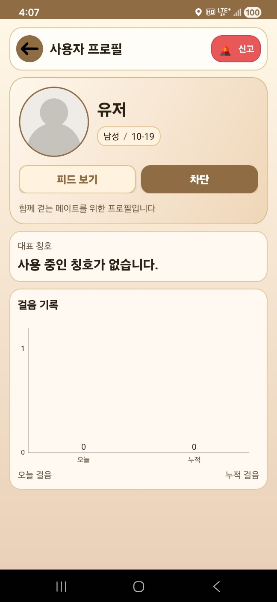

- 기능: 프로필 정보 확인, 신고/차단, 피드 보기
- 설명: 상대 사용자 정보를 보고 상호작용하는 화면

### 16. 목표 걸음 설정
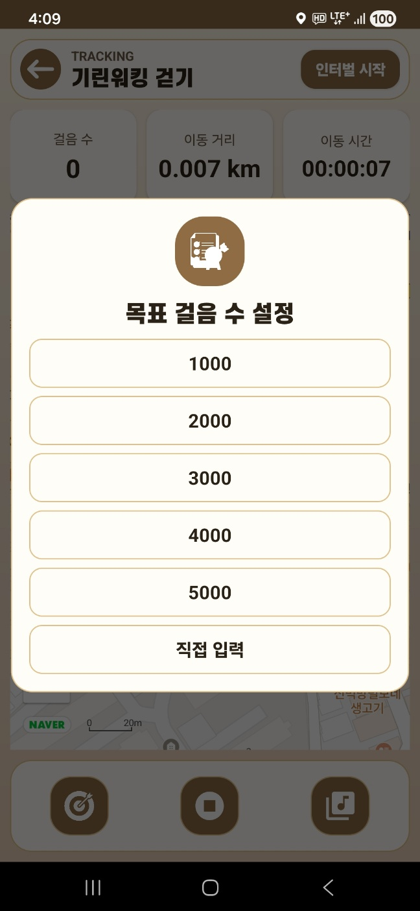

- 기능: 목표 걸음 수 프리셋/직접 입력 설정
- 설명: 트래킹 중 목표 걸음 수를 빠르게 지정하는 다이얼로그

### 17. 음악 추천 메인
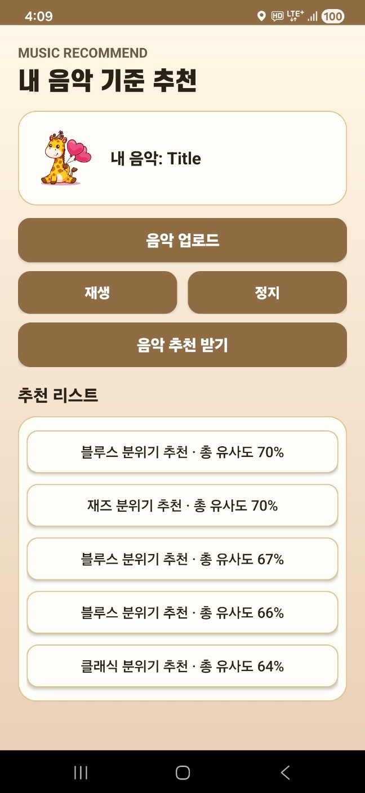

- 기능: 내 음악 업로드, 재생/정지, 유사도 기반 추천 목록 조회
- 설명: 사용자 음악 취향을 기준으로 곡을 추천받는 화면

### 18. 추천 상세 분석


- 기능: 총 유사도 및 세부 유사도(템포/에너지/리듬) 확인
- 설명: 추천된 곡과 내 음악의 유사도를 상세 분석해 보여주는 화면

### 19. 인터벌 트레이닝
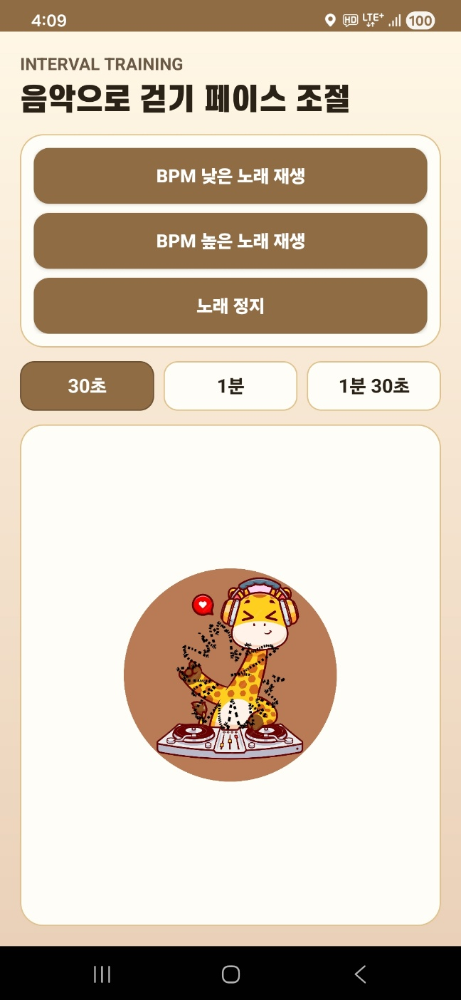

- 기능: BPM 기반 재생 제어, 인터벌 시간(30초/1분/1분30초) 설정
- 설명: 걷기 페이스를 음악으로 조절하는 트레이닝 화면

### 20. 느린 템포 재생 화면
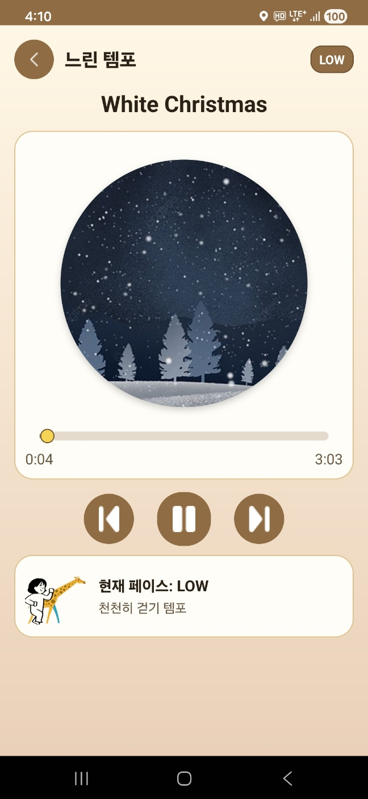

- 기능: LOW 페이스 음악 재생, 시크바/재생 컨트롤
- 설명: 천천히 걷는 구간에 맞춘 음악 재생 화면

### 21. 중간 템포 재생 화면
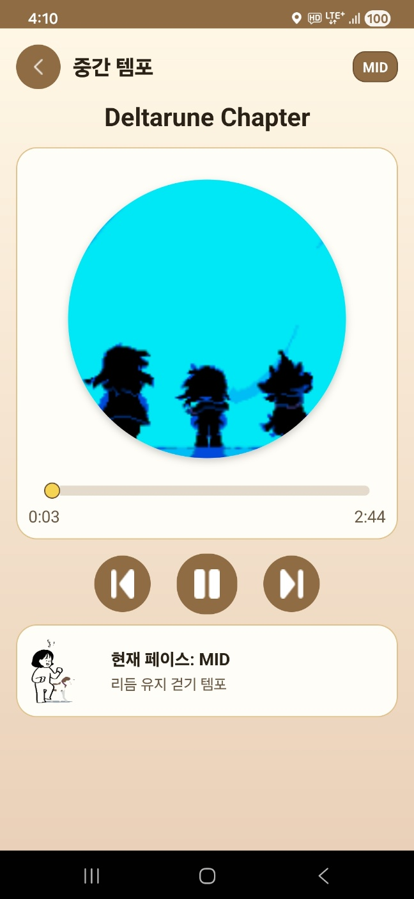

- 기능: MID 페이스 음악 재생, 현재 페이스 상태 표시
- 설명: 리듬 유지 구간에 맞춘 중간 템포 재생 화면

### 22. 빠른 템포 재생 화면


- 기능: FAST 페이스 음악 재생, 현재 페이스 상태 표시
- 설명: 빠르게 걷는 구간용 음악 재생 화면

### 23. 최대 템포 재생 화면


- 기능: MAX 페이스 음악 재생, 고강도 구간 템포 안내
- 설명: 고강도 파워워킹에 맞춘 최대 템포 재생 화면

## 기술 스택
- Language: Java
- Platform: Android
- Build: Gradle
- Backend/DB: Firebase (Firestore, Realtime Database, Storage)
- Map: Naver Maps SDK
- Network: Retrofit, Volley

## 프로젝트 구조
```text
WalkingMate/
  app/
  assets/
    screens/
  gradle/
  build.gradle
  settings.gradle
  gradlew
```
